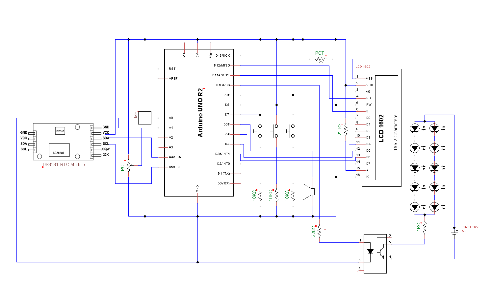

# Multifunctional Clock on Arduino Uno

### Functions
This is the code for creating a clock on Arduino. This build shows the current time, current temperature, set alarm time, and whether or not the alarm is on or off on a 16x2 LCD screen.

OOP concepts applied in the code for extra credit points

### Schematic

